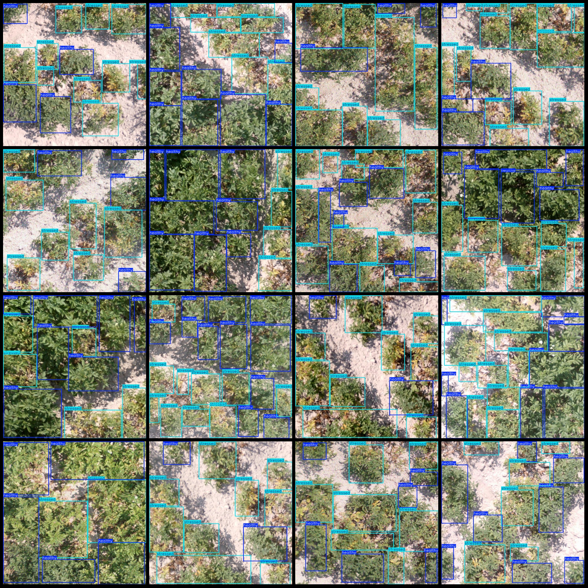
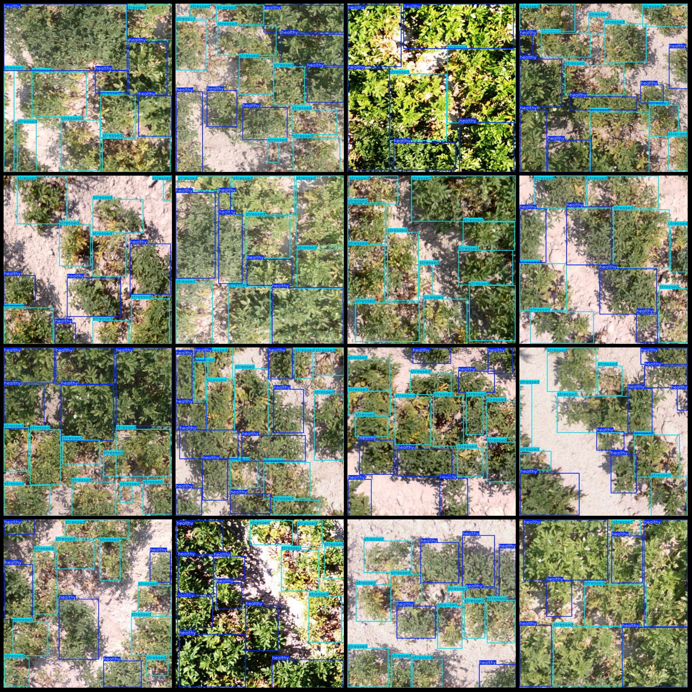
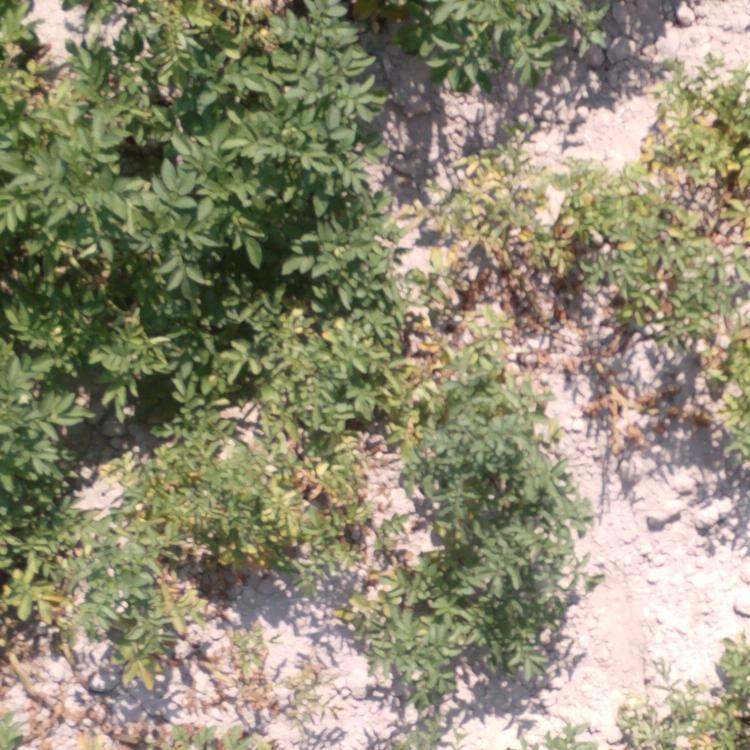

# UAV Perspective Potato and Bean Disease Detection Dataset (VOC+YOLO) - 1539 Images in 2 Classes

Note: The images are not very clear, please refer to the example images for details.

Dataset format: Pascal VOC format combined with YOLO format (txt file without split paths, only containing jpg images along with corresponding VOC format xml files and YOLO format txt files).

Number of images (number of jpg files): 1539
Number of annotations (total number of xml files): 1539
Number of annotations (total number of txt files): 1539
Number of annotation categories: 2
Annotation category names (note that the order of categories in the YOLO format does not match this, but is based on the classes.txt file in the labels folder): ["healthy", "stressed"]
Number of boxes per class:
- healthy boxes = 8470
- stressed boxes = 12436
Total boxes: 20906
Image resolution: 750x750
Annotation tools used: labelImg
UAV: DJI MAVIC 3
Acquisition height: 2-4m
Acquisition angle: 90°
Annotation rules: drawing a box around the category
Important notes: None available
Special declaration: This dataset does not guarantee the accuracy of trained models or weight files.
Image preview:

## Images

Here is a pay link on Stripe ( https://buy.stripe.com/3cs8yP7sY87d0vu9AB ). Please contact me lonlonago@foxmail.com after funding $89, and I will send you a complete data files , thank you!

